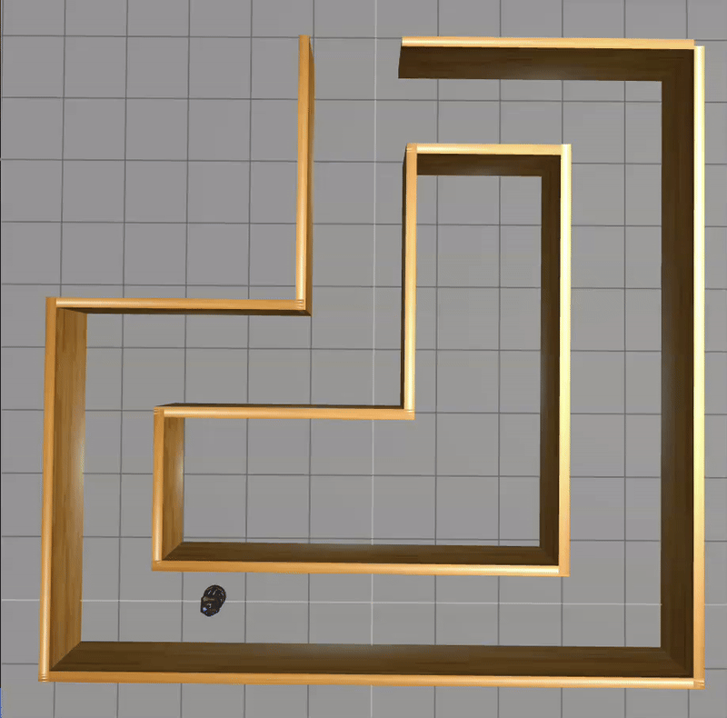

# Basic_python_robotics

### A micro project from The Construct https://app.theconstruct.ai/courses/58
#### Navigate Turtlebot3 run out from a simple maze.
#### The core code is in catkin_ws/src/robot_control/maze_navigation.py

